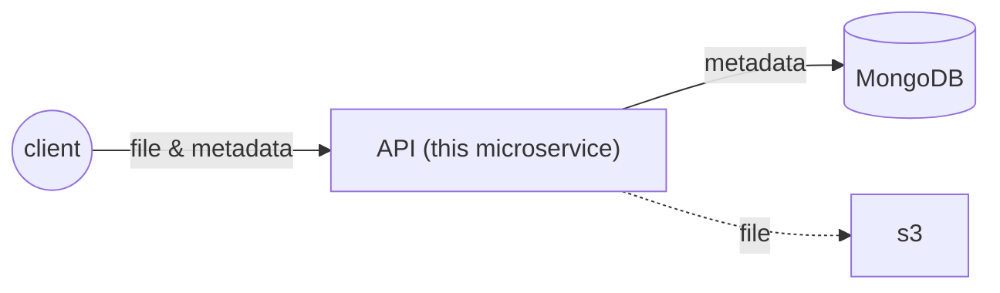

# Image storage microservice

[](https://gallery.ecr.aws/jtekt-corporation/image-storage-service)
[](https://artifacthub.io/packages/search?repo=jtekt)

A microservice to store and manage image datasets. It allows to store images with their metadata, the latter being stored in a MongoDB database.



## Data model

The metadata for uploaded images is stored in a MongoDB database with the following schema

```ts
{
  _id: ObjectId,
  file: string,
  time: Date,
  data: any,
},

```

`file` and `time` are fixed system fields while `data` is used to store user-provided properties without structural contraints.

## API

API documentation is available on `/docs`

| Route             | Method | Description                                                 |
| ----------------- | ------ | ----------------------------------------------------------- |
| /images           | POST   | Upload an image                                             |
| /images           | GET    | Get images matching filter passed as query parameter        |
| /images           | PATCH  | Updates images matching filter passed as query parameter    |
| /images           | DELETE | Deletes images matching filter passed as query parameter    |
| /images/:ID       | GET    | Get image with given ID                                     |
| /images/:ID       | DELETE | Delete image with given ID                                  |
| /images/:ID       | PATCH  | Update data of image with given ID                          |
| /images/:ID/image | GET    | Get image file of the image with ID                         |
| /export           | GET    | Export the current content as a .zip archive (experimental) |
| /import           | POST   | Upload an exported .zip archive (experimental)              |

## Environment variables

| Variable                  | Description                                                                             |
| ------------------------- | --------------------------------------------------------------------------------------- |
| `APP_PORT`                  | Port on which the application listens for requests                                      |
| `MONGODB_CONNECTION_STRING` | MongoDB Connection string                                                               |
| `UPLOADS_DIRECTORY`         | Uploads directory name, defaults to "uploads". Disabled if S3 is enabled                |
| `S3_BUCKET`                 | S3 Bucket to upload images. If set, images are uploaded to S3, otherwise stored locally |
| `S3_ACCESS_KEY_ID`          | S3 access key ID                                                                        |
| `S3_SECRET_ACCESS_KEY`      | S3 secret access key                                                                    |
| `S3_REGION`                 | S3 region                                                                               |
| `S3_ENDPOINT`               | S3 Endpoint                                                                             |

## Installment

### Development
```bash
git clone http://10.115.1.14/moreillon_ci/image_storage/storage_microservice.git
cd storage_microservice
npm install
```

set configs:
```
touch .env
```
you can write environment variables in the .env file like: 
```env
APP_PORT=8080
```

---
(option) run MongoDB with docker
```bash
docker run --name my-mongo -d -p 27017:27017 mongo:latest
```

(optional) update swagger document
```bash
npm run swagger-autogen
```

---


run the API in development mode:
```
npm run dev
```

## Docker
run the API with a published Docker image:
```
docker run  -p 8080:80 public.ecr.aws/u6l4m3e5/image-storage-service:3bded0be
```
